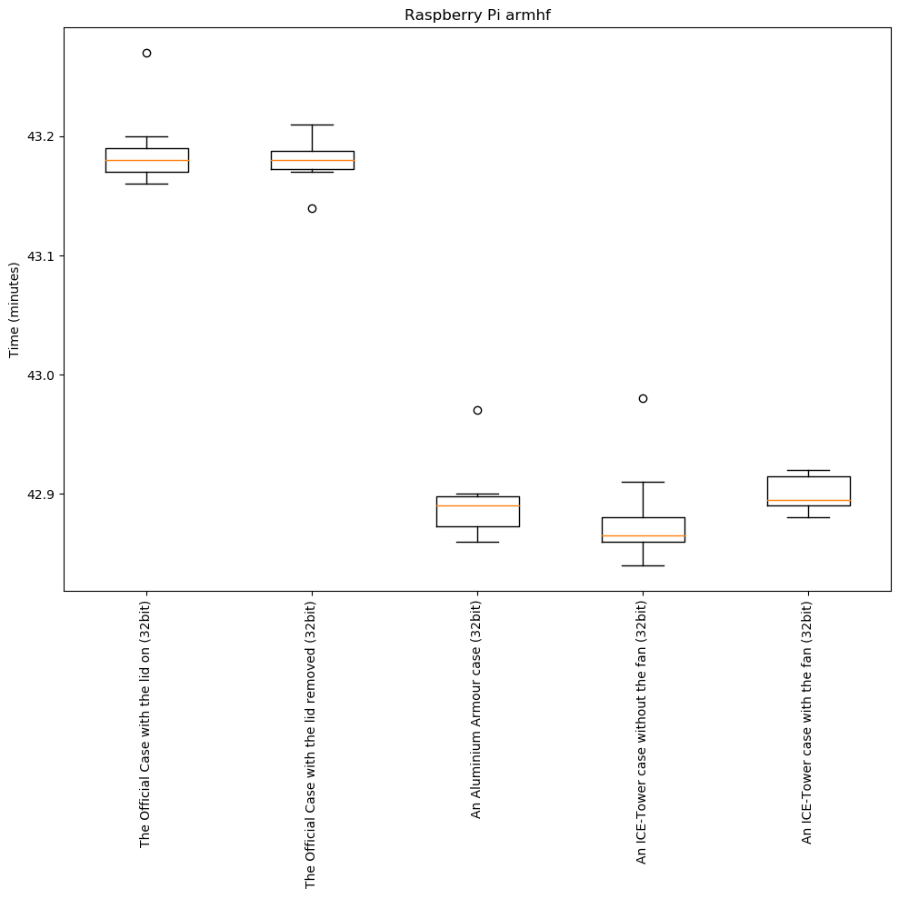
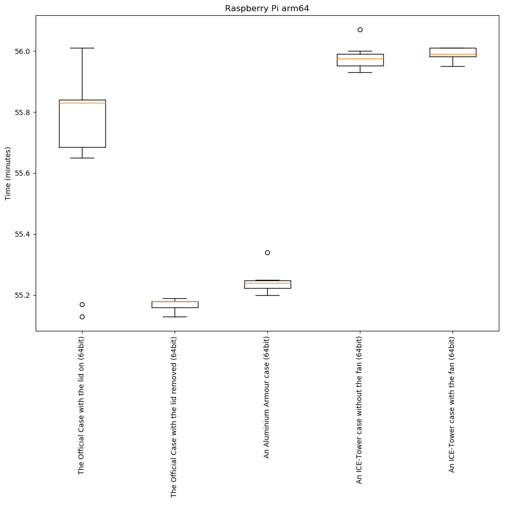
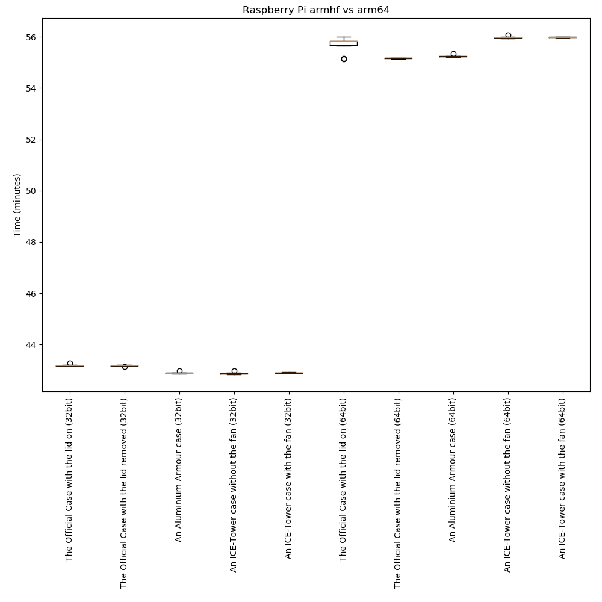

# Raspberry Pi 4 Benchmarks
# Table of contents
   * [Raspberry Pi 4 Benchmarks](#raspberry-pi-4-benchmarks)
      * [Background](#background)
      * [Aim](#aim)
      * [Method](#method)
         * [Install System](#install-system)
         * [System Size](#system-size)
         * [Copying System to Media](#copying-system-to-media)
         * [Software Versions](#software-versions)
         * [Benchmark Scripts](#benchmark-scripts)
         * [Running Method](#running-method)
         * [Raspberry Pi 4 Firmware](#raspberry-pi-4-firmware)
         * [Running Kernel Version and Memory](#running-kernel-version-and-memory)
         * [Cooling](#cooling)
      * [Results](#results)
         * [Raw](#raw)
         * [Averaged](#averaged)
      * [Graphs](#graphs)
         * [armhf (32bit)](#armhf-32bit)
         * [arm64 (64bit)](#arm64-64bit)
         * [armhf (32bit) vs arm64 (64bit)](#armhf-32bit-vs-arm64-64bit)
      * [Conclusion](#conclusion)

## Background
My main home server has been based on a Raspberry Pi for many years. With the recent Raspberry Pi 4 update I decided I would upgrade my existing Pi3. I then decided that I should replace my existing USB hard drive with a new USB3 drive. So while could just rsync to the new disk I also wanted to migrate my own servers to be managed via Ansbile, so this would really require a reinstall to achieve this.

My current setup is based on Debian running the armhf arch. It's entirely Debian with the exception of two Rasberry Pi packages (raspberrypi-bootloader, raspberrypi-kernel). I then thought about if I should move to arm64 or not.

## Aim
Find out if Debian armhr or Debian arm64 (ie 32bit vs 64bit) performs better  on Raspberry Pi 4 with a single root filesystems as an external USB3 HD (WD 5TB Elements Portable External Hard Drive, USB 3.0 https://www.amazon.co.uk/gp/product/B07X41PWTY/).

## Method
Currently the server does a mix of: Nextlcoud, LAMP, IPv6 router, IPv6 Tunnel, Jumphost. Ultimately I want these applications to perform the best. Benchmarks are hard and benchmarking all these applications would be hard. In addition simple CPU stress, or IO benchmarks would also not represent real life. So ultimately I decided to compile a Linux kernel, and the time taken to perform would be the benchmark.

Performing this does prove slightly difficult mostly because the compile is on two different architectures. The default Linux build config (defconfig) is different between archs. Hence a cross compiler is needed to build for a common target and common defconfig. Ultimately armhf does not have any cross compilers where as arm64 does have a armhf cross compiler. So the benchmark method is to build using native gcc on armhf and build using a armhf cross compiling gcc on an arm64, both using the same defconfig and both resulting in the same kernel image.

To try to keep the test fair the same Raspberry Pi and hard drive needs to be used for all the tests. For both armhf and arm64 the systems were entirely Debian with the exception of the raspberrypi-bootloader and raspberrypi-kernel packages. The SD card would be /boot and the entire 5TB USB disk is /root.

### Install System
The mechanism to build the raspberry pi disk images were copy and pasting shell commands.
```
sudo rm -r -f pi32 pi64
p="aptitude,bc,binutils,bison,bind9-host,build-essential,curl,debconf-utils,dnsutils,fake-hwclock,file,flex,git,less,libssl-dev,locales,netcat-traditional,ntp,ntpdate,pv,screen,sudo,task-ssh-server,tcpdump,telnet,vim-gtk,wget"
sudo debootstrap --arch armhf --include=$p buster pi32 http://deb.debian.org/debian &
sudo debootstrap --arch arm64 --include=$p buster pi64 http://deb.debian.org/debian &
wait

v=1.20190925+1-1
for p in raspberrypi-kernel_${v}_armhf.deb raspberrypi-bootloader_${v}_armhf.deb; do
        sudo chroot pi32 wget http://archive.raspberrypi.org/debian/pool/main/r/raspberrypi-firmware/$p
        sudo cp pi32/$p pi64

        sudo chroot pi64 dpkg --add-architecture armhf

        sudo chroot pi32 dpkg -i $p &
        sudo chroot pi64 dpkg -i $p &
        wait

        sudo rm pi32/$p
        sudo rm pi64/$p
done

sudo cp /usr/bin/qemu-arm-static pi32/usr/bin
sudo cp /usr/bin/qemu-arm-static pi64/usr/bin

echo pi32 | sudo tee pi32/etc/hostname
echo pi64 | sudo tee pi64/etc/hostname

echo "console=tty1 root=/dev/sda1 rootfstype=ext4 rootflags=commit=100,discard,data=writeback elevator=deadline fsck.repair=yes rootwait" | sudo tee pi32/boot/cmdline.txt
sudo cp pi32/boot/cmdline.txt pi64/boot/cmdline.txt

echo -en 'gpu_mem=16\ndtoverlay=vc4-fkms-v3d\n'              | sudo tee pi32/boot/config.txt
echo -en 'gpu_mem=16\ndtoverlay=vc4-fkms-v3d\narm_64bit=1\n' | sudo tee pi64/boot/config.txt

cat << EOF | sudo tee pi32/etc/fstab
/dev/mmcblb0p2 / ext4 defaults,noatime,nodiratime,errors=remount-ro,commit=100,discard,data=writeback 0 1
/dev/mmcblk0p1 /boot vfat defaults,noatime,nodiratime 0 2 
EOF
sudo cp pi32/etc/fstab pi64/etc/fstab

cat << EOF | sudo tee pi32/etc/apt/sources.list
deb     http://deb.debian.org/debian/       bullseye           main non-free contrib
deb     http://deb.debian.org/debian/       bullseye-updates   main non-free contrib
deb     http://deb.debian.org/debian/       sid                main non-free contrib
deb     http://deb.debian.org/debian/       experimental       main non-free contrib
deb     http://security.debian.org/         bullseye-security  main non-free contrib
deb [arch=armhf] http://archive.raspberrypi.org/debian/ buster main
EOF
sudo cp pi32/etc/apt/sources.list pi64/etc/apt/sources.list

curl http://archive.raspberrypi.org/debian/raspberrypi.gpg.key | sudo tee pi32/etc/apt/trusted.gpg.d/raspberrypi.asc
sudo cp pi32/etc/apt/trusted.gpg.d/raspberrypi.asc pi64/etc/apt/trusted.gpg.d/raspberrypi.asc

cat << EOF | sudo tee pi32/etc/apt/preferences
Package: *
Pin: release testing
Pin-Priority: 800

Package: *
Pin: release unstable
Pin-Priority: 700

Package: *
Pin: release experimental
Pin-Priority: 600

Package: *
Pin: origin "archive.raspberrypi.org"
Pin-Priority: -100

Package: raspberrypi-bootloader raspberrypi-kernel
Pin: origin "archive.raspberrypi.org"
Pin-Priority: 1100

EOF
sudo cp pi32/etc/apt/preferences pi64/etc/apt/preferences

cat << EOF | sudo tee pi32/etc/systemd/network/0-wired.network
[Match]
Name=e*

[Network]
DHCP=yes

[DHCP]
RouteMetric=10
ClientIdentifier=mac
EOF
sudo cp pi32/etc/systemd/network/0-wired.network pi64/etc/systemd/network/0-wired.network

sudo chroot pi32 systemctl enable systemd-networkd
sudo chroot pi64 systemctl enable systemd-networkd

echo "locales locales/default_environment_locale select en_GB.UTF-8" | sudo chroot pi32 debconf-set-selections
echo "locales locales/default_environment_locale select en_GB.UTF-8" | sudo chroot pi64 debconf-set-selections
echo "locales locales/locales_to_be_generated multiselect en_GB.UTF-8 UTF-8" | sudo chroot pi32 debconf-set-selections
echo "locales locales/locales_to_be_generated multiselect en_GB.UTF-8 UTF-8" | sudo chroot pi64 debconf-set-selections
sudo sed -i 's/^# en_GB.UTF-8 UTF-8/en_GB.UTF-8 UTF-8/' pi32/etc/locale.gen
sudo sed -i 's/^# en_GB.UTF-8 UTF-8/en_GB.UTF-8 UTF-8/' pi64/etc/locale.gen

sudo chroot pi32 dpkg-reconfigure --frontend=noninteractive locales
sudo chroot pi64 dpkg-reconfigure --frontend=noninteractive locales

sudo chroot pi32 apt-get update
sudo chroot pi64 apt-get update

sudo chroot pi32 sudo apt-get -y -t unstable install gcc
sudo chroot pi64 sudo apt-get -y -t unstable install gcc

sudo chroot pi32 adduser --disabled-login --gecos thomas thomas
sudo chroot pi64 adduser --disabled-login --gecos thomas thomas

echo "thomas ALL=(ALL:ALL) NOPASSWD: ALL" | sudo tee pi32/etc/sudoers.d/thomas
sudo cp pi32/etc/sudoers.d/thomas pi64/etc/sudoers.d/thomas
sudo chmod 400 pi32/etc/sudoers.d/thomas pi64/etc/sudoers.d/thomas

sudo chroot pi32 su -c "wget https://github.com/torvalds/linux/archive/v5.4.tar.gz" - thomas
sudo cp pi32/home/thomas/v5.4.tar.gz pi64/home/thomas/v5.4.tar.gz
sudo chroot pi32 su -c "tar xf v5.4.tar.gz" - thomas &
sudo chroot pi64 su -c "tar xf v5.4.tar.gz" - thomas &
wait

cat << EOF | sudo tee pi32/home/thomas/linux-5.4/run.sh
#!/bin/bash -x
export KBUILD_BUILD_TIMESTAMP="16 Dec 2019 00:00:00"
export KBUILD_BUILD_HOST=pi
make mrproper
make defconfig
(time make -j 4 zImage; md5sum arch/arm/boot/zImage 1>&2) 2> result.\$(date +%s)
EOF

sudo chroot pi64 apt-get -y install gcc-arm-linux-gnueabihf
cat << EOF | sudo tee pi64/home/thomas/linux-5.4/run.sh
#!/bin/bash -x
export KBUILD_BUILD_TIMESTAMP="16 Dec 2019 00:00:00"
export KBUILD_BUILD_HOST=pi
export ARCH=arm
export CROSS_COMPILE=arm-linux-gnueabihf- 
make mrproper
make defconfig
(time make -j 4 zImage; md5sum arch/arm/boot/zImage 1>&2) 2> result.\$(date +%s)
EOF

sudo chmod +x pi32/home/thomas/linux-5.4/run.sh pi64/home/thomas/linux-5.4/run.sh
```

After which two more steps to set the root password and thomas password were formed using
```
sudo chroot pi32 passwd
sudo chroot pi32 passwd thomas
sudo chroot pi64 passwd
sudo chroot pi64 passwd thomas
```

### System Size
Interestingly the 64 bit system is 15% larger than 32 bit on disk:
```
$ sudo du -sh pi32 pi64
2.6G	pi32
3.0G	pi64
```

### Copying System to Media
The following command copy the system to the media for the 32bit test
```
sudo rm -r -f /media/thomas/root/* /media/thomas/boot/*

sudo rsync -cax --delete ./pi32/. /media/thomas/root/.
sudo rsync -crptx --delete ./pi32/boot/. /media/thomas/boot/.
sudo umount /media/thomas/boot /media/thomas/root
```

Later to update to the 64 bit test (note that the Linux src will remain on the same inodes on disk):
```
sudo rsync -cax --delete ./pi64/. /media/thomas/root/.
sudo rsync -crptx --delete ./pi64/boot/. /media/thomas/boot/.
sudo umount /media/thomas/boot /media/thomas/root

```

### Software Versions
The versions of all the software were recorded via "dpkg -l" and saved into [dpkg-l.pi32.txt](dpkg-l.pi32.txt) and [dpkg-l.pi64.txt](dpkg-l.pi64.txt). The git ref for the linux repo is 219d543.


### Benchmark Scripts
The benchmark scripts are embedded into the above build script, however to aid readability the first step is to download the source from https://github.com/torvalds/linux/archive/v5.4.tar.gz and extract. Each system has a run.sh script created. The first step is to fix the build timestamp and host, so that the end images will be the same, thanks to reproducible builds this works. The next step is to completely clean the source with make mrpropper. Then on arm64 set it to cross compile and make a defconfig default config. The last step is to bild zImage, run an md5sum to verify the image and to record the time taken.

The armhf looks like:
```
#!/bin/bash -x
export KBUILD_BUILD_TIMESTAMP="16 Dec 2019 00:00:00"
export KBUILD_BUILD_HOST=pi
make mrproper
make defconfig
(time make -j 4 zImage; md5sum arch/arm/boot/zImage 1>&2) 2> result.$(date +%s)
```

The arm64 one looks like:
```
export KBUILD_BUILD_TIMESTAMP="16 Dec 2019 00:00:00"
export KBUILD_BUILD_HOST=pi
export ARCH=arm
export CROSS_COMPILE=arm-linux-gnueabihf- 
make mrproper
make defconfig
(time make -j 4 zImage; md5sum arch/arm/boot/zImage 1>&2) 2> result.\$(date +%s)
```

### Running Method
Each benchmark was repeated 10 times, the method to run a benchmark was to boot the Rapsberry Pi, ssh to it and run the following:
```
screen
cd linux-5.4/
for n in $(seq 10); do ./run.sh; done
```

### Raspberry Pi 4 Firmware
The firmware of the Rasbperry Pi 4 was updated by running a Rasbian image. The firmware at the time was the following: 
```
root@raspberrypi:~# rpi-eeprom-update
BOOTLOADER: up-to-date
CURRENT: Tue 10 Sep 10:41:50 UTC 2019 (1568112110)
 LATEST: Tue 10 Sep 10:41:50 UTC 2019 (1568112110)
VL805: up-to-date
CURRENT: 000137ab
 LATEST: 000137ab
root@raspberrypi:~#
```

### Running Kernel Version and Memory
Once booted each system had "uname -a" and "free -h" run. On the 32 bit it looked like:
```
thomas@pi32:~$ uname -a
Linux pi32 4.19.75-v7l+ #1270 SMP Tue Sep 24 18:51:41 BST 2019 armv7l GNU/Linux
thomas@pi32:~$ 
thomas@pi32:~$ free -h
              total        used        free      shared  buff/cache   available
Mem:          3.9Gi        88Mi       3.0Gi        16Mi       772Mi       3.7Gi
Swap:            0B          0B          0B
thomas@pi32:~$ 
```

On the 64 bit it looked like:
```
thomas@pi64:~$ uname -a
Linux pi64 4.19.75-v8+ #1270 SMP PREEMPT Tue Sep 24 18:59:17 BST 2019 aarch64 GNU/Linux
thomas@pi64:~$ 
thomas@pi64:~$ free -h
              total        used        free      shared  buff/cache   available
Mem:          3.8Gi        91Mi       3.6Gi        16Mi        83Mi       3.6Gi
Swap:            0B          0B          0B
thomas@pi64:~$ 
```

### Cooling
During the Benchmark the fact that Raspberry Pi 4 boards run a lot hotter showed. I wanted to run the test with different hardware configurations that might influence the final deployment. I also wanted to prove that the CPU was not being throttled, and thus artificially capping the results. So the benchmark was repeated 10 times on armhf and arm64 with the following six configurations:
 1. The Official Case with the lid on
 1. The Official Case with the lid removed
 1. An Aluminium Armour case (https://thepihut.com/products/aluminium-armour-heatsink-case-for-raspberry-pi-4)
 1. An ICE-Tower case without the fan (https://thepihut.com/products/ice-tower-raspberry-pi-4-cpu-cooler)
 1. An ICE-Tower case with the fan (https://thepihut.com/products/ice-tower-raspberry-pi-4-cpu-cooler)

Some references I used:
 . https://www.jeffgeerling.com/blog/2019/raspberry-pi-4-needs-fan-heres-why-and-how-you-can-add-one
 . https://www.raspberrypi.org/blog/thermal-testing-raspberry-pi-4/

The vcgencmd tool can be used to find out the CPU temp and if any CPU throttling has occured:
```
root@raspberrypi:~# vcgencmd measure_temp
temp=60.0'C'
root@raspberrypi:~# vcgencmd get_throttled
throttled=0x0
root@raspberrypi:~#
```

However vcgencmd is part of the Raspberry Pi closed firmware and thus does not run on arm64. Fortunately the cpu temp is reported in the sysfs filesystem:
```
root@raspberrypi:~# cat /sys/devices/virtual/thermal/thermal_zone0/temp 
60861
root@raspberrypi:~# 
```

The CPU throttles at 60C, as I wanted to prove this for the test, I didn't want to interfere with the numbers, so I just checked the temp during the ICE-Tower test, some 10 minutes in. Without the fan it was 49C and with the fan it was 39C, thus it is highly likely the CPU didn't throttle for the ICT-Tower with fan run.

## Results
The results were captured and stored in the [raw-results.txt](raw-results.txt]) file. The ICT-Tower tests were performed last. The raw results have been extracted and showed below.

### Raw

 1. The Official Case with the lid on (32bit) data: 43m15.902s 43m11.033s 43m11.276s 43m10.015s 43m12.036s 43m9.884s 43m11.145s 43m9.960s 43m9.876s 43m11.020s
 1. The Official Case with the lid removed (32bit) data: 43m10.650s 43m11.010s 43m8.535s 43m11.015s 43m10.457s 43m11.232s 43m11.437s 43m10.302s 43m11.014s 43m12.690s
 1. An Aluminium Armour case (32bit) data: 42m58.007s 42m51.496s 42m52.415s 42m53.284s 42m51.715s 42m52.886s 42m54.284s 42m53.517s 42m53.503s 42m54.218s
 1. An ICE-Tower case without the fan (32bit) data: 42m58.964s 42m54.885s 42m52.355s 42m50.546s 42m51.672s 42m51.357s 42m50.118s 42m51.581s 42m53.007s 42m52.555s
 1. An ICE-Tower case with the fan (32bit) data: 42m53.549s 42m53.206s 42m53.854s 42m54.902s 42m53.677s 42m53.016s 42m53.346s 42m54.208s 42m55.307s 42m55.457s
 1. The Official Case with the lid on (64bit) data: 56m0.639s 55m50.670s 55m50.138s 55m47.318s 55m49.335s 55m50.565s 55m50.333s 55m38.820s 55m10.400s 55m7.593s
 1. The Official Case with the lid removed (64bit) data: 55m9.495s 55m10.977s 55m10.736s 55m7.511s 55m9.524s 55m9.841s 55m11.216s 55m10.617s 55m11.259s 55m11.089s
 1. An Aluminium Armour case (64bit) data: 55m20.320s 55m14.748s 55m14.238s 55m14.703s 55m13.228s 55m13.075s 55m13.987s 55m12.207s 55m14.170s 55m14.642s
 1. An ICE-Tower case without the fan (64bit) data: 56m4.270s 55m57.949s 56m0.231s 55m57.002s 55m56.020s 55m58.625s 55m59.630s 55m57.875s 55m56.967s 55m59.537s
 1. An ICE-Tower case with the fan (64bit) data: 55m58.401s 56m0.375s 56m0.491s 56m0.442s 55m59.485s 55m57.220s 55m59.149s 56m0.650s 55m59.686s 55m58.864s

### Averaged

| Test | Averate time taken to complete (minutes) |
| ---  | --- |
| The Official Case with the lid on (32bit)      | 43.19 |
| The Official Case with the lid removed (32bit) | 43.18 |
| An Aluminium Armour case (32bit)               | 42.89 |
| An ICE-Tower case without the fan (32bit)      | 42.88 |
| An ICE-Tower case with the fan (32bit)         | 42.90 |
| The Official Case with the lid on (64bit)      | 55.69 |
| The Official Case with the lid removed (64bit) | 55.17 |
| An Aluminium Armour case (64bit)               | 55.24 |
| An ICE-Tower case without the fan (64bit)      | 55.98 |
| An ICE-Tower case with the fan (64bit)         | 55.99 |

## Graphs
The graphs were created using the amazing https://matplotlib.org/ using a small [plot.py](plot.py) script.

### armhf (32bit)


### arm64 (64bit)


### armhf (32bit) vs arm64 (64bit)


## Conclusion
The type of case configuraiton does not really effect overall speed.

Assuming that we considar the ICE-Tower with fan number numbers, 64bit is 30% slower thatn 32bit.
